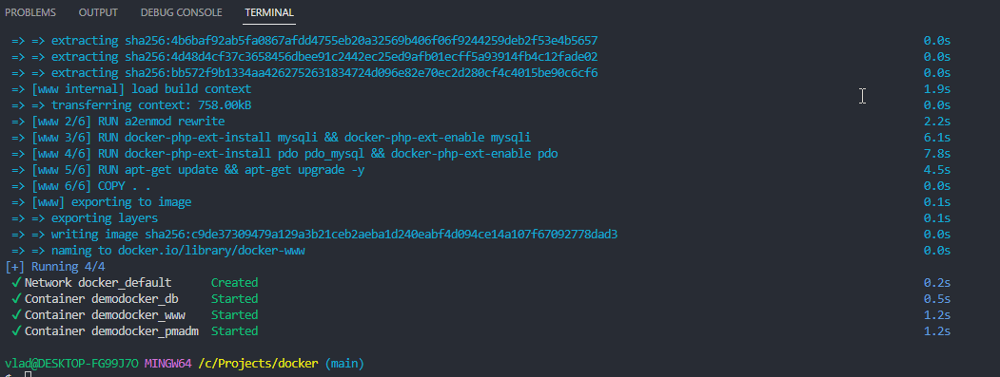
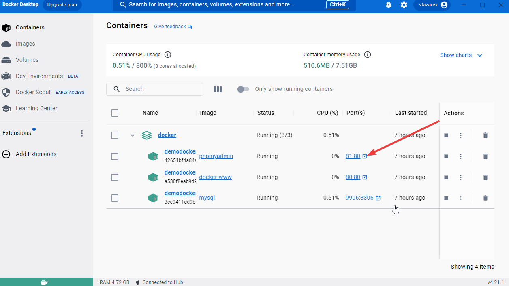
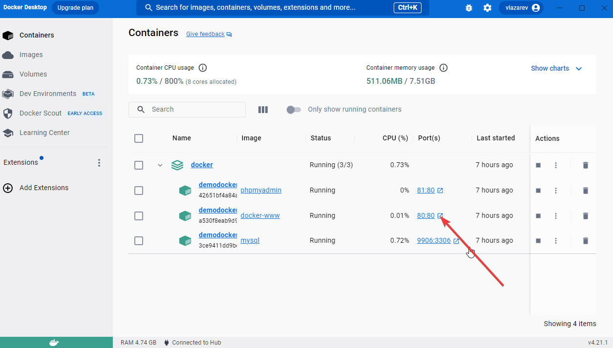
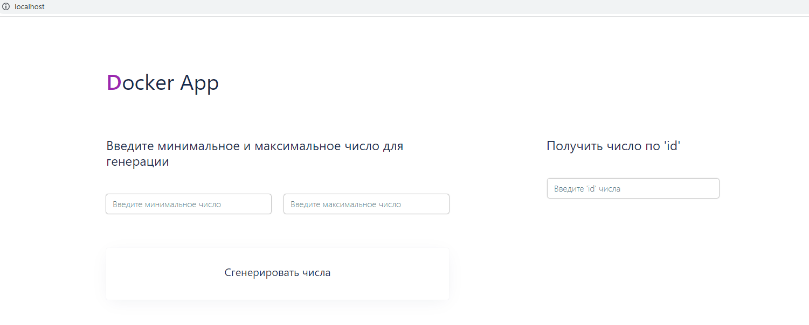

## Docker App

Цель проекта - докеризация приложения.

Для тестирования нужно клонировать репозиторий. Пререйти в терминале в дирректорию 
с проектом и выполнить команду:

```bash
docker-compose up -d
```

Подождать, пока закончится установка. В терминале будет примерно так:



В Docker Desktop перейти в phpmyadmin, user: root, password: root 



Выполнить import файла 'demodocker.sql' для базы данных 'demodocker' (файл 'demodocker.sql'
находится в корне проекта).

Открыть проект в Docker Desktop:



В браузере будет так:



Нужно ввести цифры, например минимальное число 1 и максимальное число 10. В таблице БД
будет примерно так: id=1 rund_num=8, id=2 rand_num=4 и тд

И теперь можно найти число по его id от 1 до 10.

